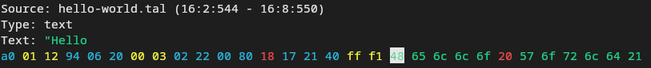

# romviz - Rom visualization using debug info

Using [debug](./dbg.md) info from the assembler, romviz can visualize every byte in the rom:

Different symbols are highlighted with colors:

* Cyan: Opcode
* Yello: Label reference
  Press Enter to follow the reference
* Red: Number
* Green: Text

This was mostly a test for reading&writing debug symbol files.
